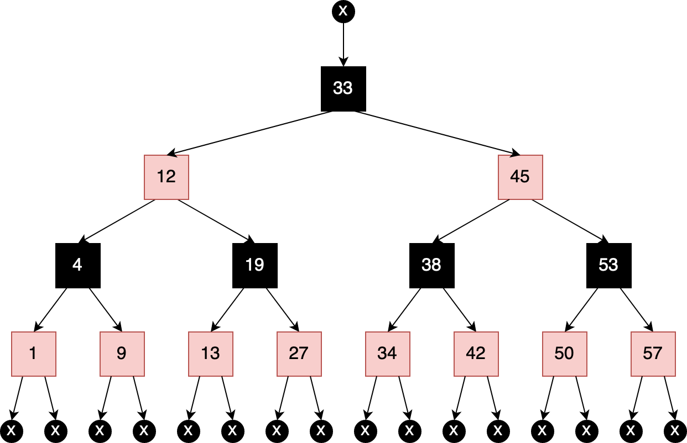
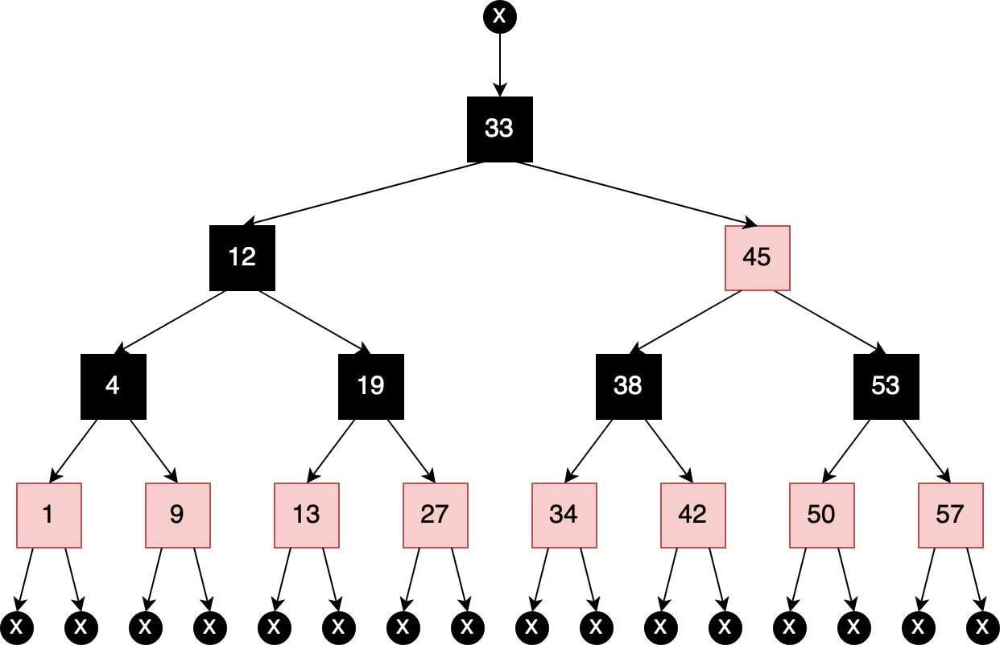
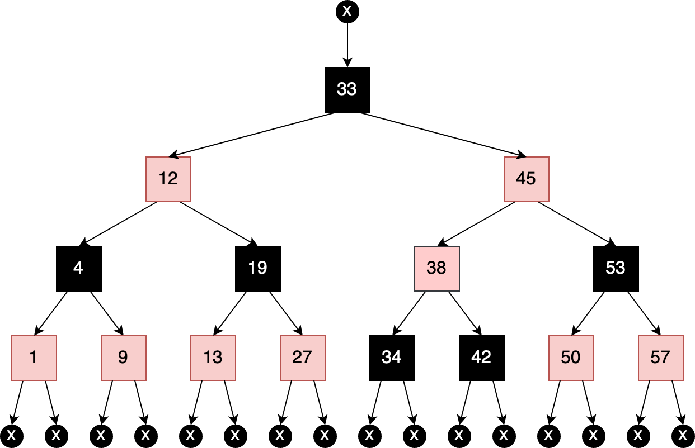
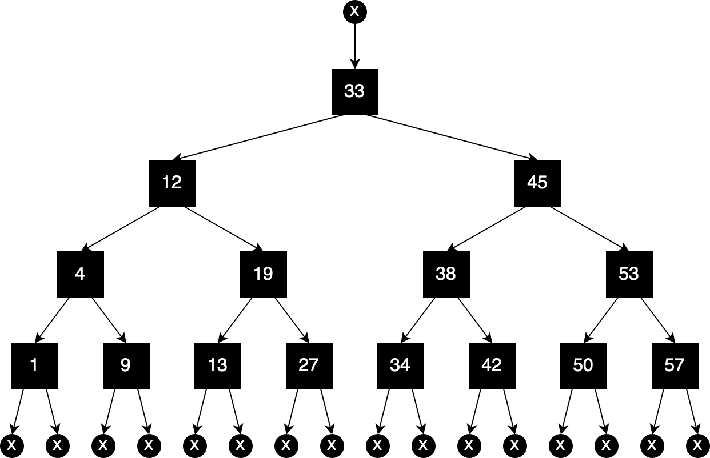
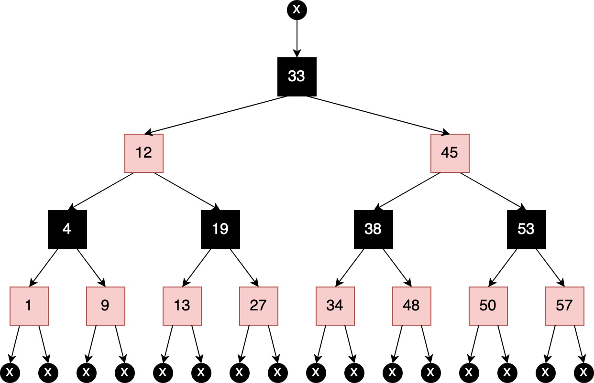

# Red-Black-Tree Rules

## Learning Objectives

By the end of this module, students will be able to...

* **Define** the terms red-black tree, black-depth and rebalance
* **Explain** how, by following a set of rules, red-black trees can keep themselves balanced as they grow
* **List** the red-black tree rules

## Lesson Content

<iframe src="https://adaacademy.hosted.panopto.com/Panopto/Pages/Embed.aspx?id=83d47dd1-0d89-4526-bf48-abbb000b4fbc&autoplay=false&offerviewer=true&showtitle=true&showbrand=false&start=0&interactivity=all" width=720 height=405 style="border: 1px solid #464646;" allowfullscreen allow="autoplay"></iframe>

## Challenges

<!-- >>>>>>>>>>>>>>>>>>>>>> BEGIN CHALLENGE >>>>>>>>>>>>>>>>>>>>>> -->
<!-- Replace everything in square brackets [] and remove brackets  -->

### !challenge

* type: multiple-choice
* id: c23e6820-bdec-42e6-8ad1-ab516b2dddf0
* title: Valid red-black trees A
<!-- * points: [1] (optional, the number of points for scoring as a checkpoint) -->
<!-- * topics: [python, pandas] (optional the topics for analyzing points) -->

##### !question

Which if any of the RBT rules does the following tree violate?

##### !end-question

##### !options

* Rule 1 - not a valid BST
* Rule 2 - the root is not black
* Rule 3 - the root's parent or a leaf is not black
* Rule 4 - two red nodes in a row
* Rule 5 - leaves have different black depths
* None - this is a valid Red-Black Tree

##### !end-options

##### !answer

* None - this is a valid Red-Black Tree

##### !end-answer

<!-- other optional sections -->
<!-- !hint - !end-hint (markdown, users can see after a failed attempt) -->
<!-- !rubric - !end-rubric (markdown, instructors can see while scoring a checkpoint) -->
<!-- !explanation - !end-explanation (markdown, students can see after answering correctly) -->

### !end-challenge

<!-- ======================= END CHALLENGE ======================= -->
<!-- >>>>>>>>>>>>>>>>>>>>>> BEGIN CHALLENGE >>>>>>>>>>>>>>>>>>>>>> -->
<!-- Replace everything in square brackets [] and remove brackets  -->

### !challenge

* type: multiple-choice
* id: 11755112-c210-4ae3-9d57-9f038c41f214
* title: Valid red-black trees B
<!-- * points: [1] (optional, the number of points for scoring as a checkpoint) -->
<!-- * topics: [python, pandas] (optional the topics for analyzing points) -->

##### !question

Which if any of the RBT rules does the following tree violate?

##### !end-question

##### !options

* Rule 1 - not a valid BST
* Rule 2 - the root is not black
* Rule 3 - the root's parent or a leaf is not black
* Rule 4 - two red nodes in a row
* Rule 5 - leaves have different black depths
* None - this is a valid Red-Black Tree

##### !end-options

##### !answer

* Rule 5 - leaves have different black depths

##### !end-answer

<!-- other optional sections -->
<!-- !hint - !end-hint (markdown, users can see after a failed attempt) -->
<!-- !rubric - !end-rubric (markdown, instructors can see while scoring a checkpoint) -->
<!-- !explanation - !end-explanation (markdown, students can see after answering correctly) -->

### !end-challenge

<!-- ======================= END CHALLENGE ======================= -->
<!-- >>>>>>>>>>>>>>>>>>>>>> BEGIN CHALLENGE >>>>>>>>>>>>>>>>>>>>>> -->
<!-- Replace everything in square brackets [] and remove brackets  -->

### !challenge

* type: multiple-choice
* id: dbd8cf93-63cf-4222-97ab-4815cbeaa71d
* title: Valid red-black trees C
<!-- * points: [1] (optional, the number of points for scoring as a checkpoint) -->
<!-- * topics: [python, pandas] (optional the topics for analyzing points) -->

##### !question

Which if any of the RBT rules does the following tree violate?

##### !end-question

##### !options

* Rule 1 - not a valid BST
* Rule 2 - the root is not black
* Rule 3 - the root's parent or a leaf is not black
* Rule 4 - two red nodes in a row
* Rule 5 - leaves have different black depths
* None - this is a valid Red-Black Tree

##### !end-options

##### !answer

* Rule 4 - two red nodes in a row

##### !end-answer

<!-- other optional sections -->
<!-- !hint - !end-hint (markdown, users can see after a failed attempt) -->
<!-- !rubric - !end-rubric (markdown, instructors can see while scoring a checkpoint) -->
<!-- !explanation - !end-explanation (markdown, students can see after answering correctly) -->

### !end-challenge

<!-- ======================= END CHALLENGE ======================= -->
<!-- >>>>>>>>>>>>>>>>>>>>>> BEGIN CHALLENGE >>>>>>>>>>>>>>>>>>>>>> -->
<!-- Replace everything in square brackets [] and remove brackets  -->

### !challenge

* type: multiple-choice
* id: 8f8ca3cb-3aaf-4aef-9228-177e91f96dfd
* title: Valid red-black trees D
<!-- * points: [1] (optional, the number of points for scoring as a checkpoint) -->
<!-- * topics: [python, pandas] (optional the topics for analyzing points) -->

##### !question

Which if any of the RBT rules does the following tree violate?

##### !end-question

##### !options

* Rule 1 - not a valid BST
* Rule 2 - the root is not black
* Rule 3 - the root's parent or a leaf is not black
* Rule 4 - two red nodes in a row
* Rule 5 - leaves have different black depths
* None - this is a valid Red-Black Tree

##### !end-options

##### !answer

* None - this is a valid Red-Black Tree

##### !end-answer

<!-- other optional sections -->
<!-- !hint - !end-hint (markdown, users can see after a failed attempt) -->
<!-- !rubric - !end-rubric (markdown, instructors can see while scoring a checkpoint) -->
<!-- !explanation - !end-explanation (markdown, students can see after answering correctly) -->

### !end-challenge

<!-- ======================= END CHALLENGE ======================= -->

<!-- >>>>>>>>>>>>>>>>>>>>>> BEGIN CHALLENGE >>>>>>>>>>>>>>>>>>>>>> -->
<!-- Replace everything in square brackets [] and remove brackets  -->

### !challenge

* type: multiple-choice
* id: 93d322b3-8bcb-488e-9996-9df4a963f1e1
* title: Valid red-black trees E
<!-- * points: [1] (optional, the number of points for scoring as a checkpoint) -->
<!-- * topics: [python, pandas] (optional the topics for analyzing points) -->

##### !question

Which if any of the RBT rules does the following tree violate?

##### !end-question

##### !options

* Rule 1 - not a valid BST
* Rule 2 - the root is not black
* Rule 3 - the root's parent or a leaf is not black
* Rule 4 - two red nodes in a row
* Rule 5 - leaves have different black depths
* None - this is a valid Red-Black Tree

##### !end-options

##### !answer

* Rule 1 - not a valid BST

##### !end-answer

<!-- other optional sections -->
<!-- !hint - !end-hint (markdown, users can see after a failed attempt) -->
<!-- !rubric - !end-rubric (markdown, instructors can see while scoring a checkpoint) -->
<!-- !explanation - !end-explanation (markdown, students can see after answering correctly) -->

### !end-challenge

<!-- ======================= END CHALLENGE ======================= -->