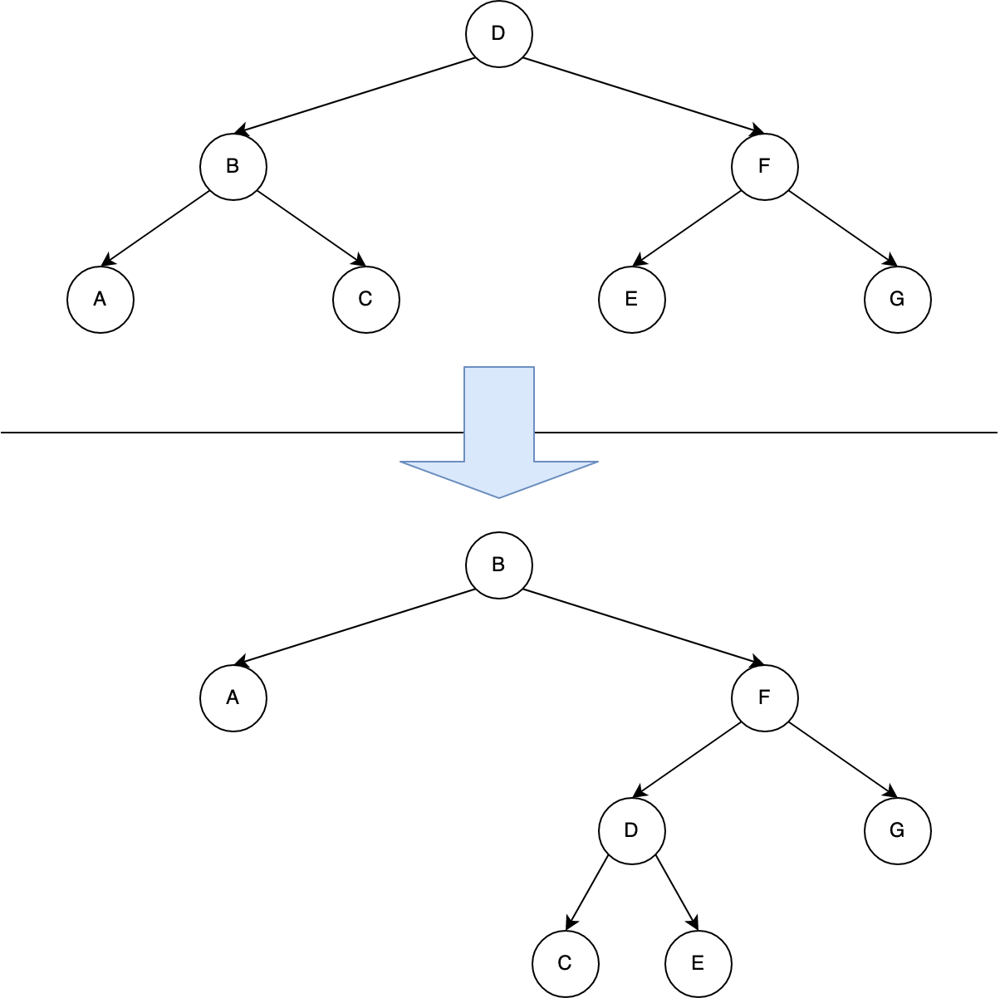
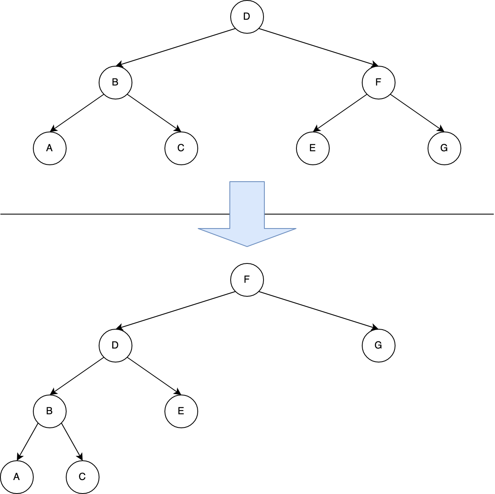

# Rotations

## Learning Objectives

By the end of this module, students will be able to...

* **Define** the term rotation
* **Describe** the algorithm to rotate a node of a tree left or right

## Lesson Content

This is a short one, so instead of a video it's presented as a reading.

### Rotations

A _rotation_ is an operation on a subtree that changes the _subtree root_.


When you rotate **left**, the old root's **right** child becomes the new root, and the old root becomes the new root's **left** child.

The opposite is true of **right rotations**.

The BST property is preserved through a rotation. We've changed which node is the root, without getting the nodes out of order. If you're not convinced, draw a picture like the one above, but assign a value to each node. Are they still in order after rotating?

### Steps for a left rotation:

1. Rotate is called with a reference to the old subtree root:

    ```js
    _rotateLeft(node) {
      // ...
    }
    ```

1. Take a reference to the child that will become the new subtree root:

    ```js
    child = node.right
    ```

1. Turn child's left subtree into node's right subtree:

    ```js
    node.right = child.left
    if (child.left !== RBTNode.sentinel) {
      child.left.parent = node;
    }
    ```

1. Link node's parent to child. Note the special case if the node is the root of the entire tree.

    ```js
    child.parent = node.parent;
    if (node === this._root) {
      this._root = child;
    } else if (node === node.parent.left) {
      node.parent.left = child;
    } else {
      node.parent.right = child;
    }
    ```

1. Put node on child's left

    ```js
    child.left = node;
    node.parent = child;
    ```

## Challenges

How does rotation affect the depth of each of these nodes?

Consider the following red-black subtree, how does rotation affect black-depth? (preview the black uncle steps)

<!-- >>>>>>>>>>>>>>>>>>>>>> BEGIN CHALLENGE >>>>>>>>>>>>>>>>>>>>>> -->
<!-- Replace everything in square brackets [] and remove brackets  -->

### !challenge

* type: multiple-choice
* id: 9acc3b23-1dca-432d-9d53-a12d06003cc6
* title: Rotation complexity
<!-- * points: [1] (optional, the number of points for scoring as a checkpoint) -->
<!-- * topics: [python, pandas] (optional the topics for analyzing points) -->

##### !question

If \\(n\\) is the number of nodes in the subtree and \\(h\\) is the height of the subtree, what is the time complexity of rotation?

##### !end-question

##### !options

* Constant
* \\(O(log(n))\\)
* \\(O(h)\\)
* \\(O(n)\\)

##### !end-options

##### !answer

* Constant

##### !end-answer

##### !explanation

Rotation updates the same number of links every time, regardless of how big the subtree is. Note that the code above contains no loops and no recursive calls.

##### !end-explanation

<!-- other optional sections -->
<!-- !hint - !end-hint (markdown, users can see after a failed attempt) -->
<!-- !rubric - !end-rubric (markdown, instructors can see while scoring a checkpoint) -->
<!-- !explanation - !end-explanation (markdown, students can see after answering correctly) -->

### !end-challenge

<!-- ======================= END CHALLENGE ======================= -->
<!-- >>>>>>>>>>>>>>>>>>>>>> BEGIN CHALLENGE >>>>>>>>>>>>>>>>>>>>>> -->
<!-- Replace everything in square brackets [] and remove brackets  -->

### !challenge

* type: multiple-choice
* id: 60422ac7-dfe5-40cc-938d-88ea73929986
* title: Rotation sequence
<!-- * points: [1] (optional, the number of points for scoring as a checkpoint) -->
<!-- * topics: [python, pandas] (optional the topics for analyzing points) -->

##### !question

Which of the following sequences of rotations would transform the top tree to the bottom tree?



##### !end-question

##### !options

* Rotate `D` left, rotate `D` right
* Rotate `D` right, rotate `D` left
* Rotate `D` right, rotate `F` left
* None of the above

##### !end-options

##### !answer

* Rotate `D` right, rotate `D` left

##### !end-answer

<!-- other optional sections -->
<!-- !hint - !end-hint (markdown, users can see after a failed attempt) -->
<!-- !rubric - !end-rubric (markdown, instructors can see while scoring a checkpoint) -->
<!-- !explanation - !end-explanation (markdown, students can see after answering correctly) -->

### !end-challenge


<!-- ======================= END CHALLENGE ======================= -->

### Rotation Depths

For the next questions, consider the following right-rotation of node `D`:



<!-- >>>>>>>>>>>>>>>>>>>>>> BEGIN CHALLENGE >>>>>>>>>>>>>>>>>>>>>> -->
<!-- Replace everything in square brackets [] and remove brackets  -->

### !challenge

* type: multiple-choice
* id: cf63fe1a-c05d-413b-8f2e-5dd836ee3971
* title: Node D
<!-- * points: [1] (optional, the number of points for scoring as a checkpoint) -->
<!-- * topics: [python, pandas] (optional the topics for analyzing points) -->

##### !question

What happened to node `D`?

##### !end-question

##### !options

* Its depth decreased by 1
* Its depth stayed the same
* Its depth increased by 1

##### !end-options

##### !answer

* Its depth increased by 1

##### !end-answer

<!-- other optional sections -->
<!-- !hint - !end-hint (markdown, users can see after a failed attempt) -->
<!-- !rubric - !end-rubric (markdown, instructors can see while scoring a checkpoint) -->
<!-- !explanation - !end-explanation (markdown, students can see after answering correctly) -->

### !end-challenge

<!-- ======================= END CHALLENGE ======================= -->


<!-- >>>>>>>>>>>>>>>>>>>>>> BEGIN CHALLENGE >>>>>>>>>>>>>>>>>>>>>> -->
<!-- Replace everything in square brackets [] and remove brackets  -->

### !challenge

* type: multiple-choice
* id: 24ef6233-cb08-4262-a393-bc70aa5d1cd1
* title: Right subtree
<!-- * points: [1] (optional, the number of points for scoring as a checkpoint) -->
<!-- * topics: [python, pandas] (optional the topics for analyzing points) -->

##### !question

What happened to the nodes to the right of `D`?

##### !end-question

##### !options

* The depth of every node in `D`'s right subtree (rooted at `B`) decreased by 1
* The depth of every node in `D`'s right subtree (rooted at `B`) stayed the same
* The depth of every node in `D`'s right subtree (rooted at `B`) increased by 1
* None of the above

##### !end-options

##### !answer

* The depth of every node in `D`'s right subtree (rooted at `B`) increased by 1

##### !end-answer

<!-- other optional sections -->
<!-- !hint - !end-hint (markdown, users can see after a failed attempt) -->
<!-- !rubric - !end-rubric (markdown, instructors can see while scoring a checkpoint) -->
<!-- !explanation - !end-explanation (markdown, students can see after answering correctly) -->

### !end-challenge

<!-- ======================= END CHALLENGE ======================= -->
<!-- >>>>>>>>>>>>>>>>>>>>>> BEGIN CHALLENGE >>>>>>>>>>>>>>>>>>>>>> -->
<!-- Replace everything in square brackets [] and remove brackets  -->

### !challenge

* type: multiple-choice
* id: 998062c5-7c3b-46e3-a6b7-f63778b44696
* title: Right subtree
<!-- * points: [1] (optional, the number of points for scoring as a checkpoint) -->
<!-- * topics: [python, pandas] (optional the topics for analyzing points) -->

##### !question

What happened to the nodes to the left of `D`?

##### !end-question

##### !options

* The depth of every node in `D`'s left subtree (rooted at `F`) decreased by 1
* The depth of every node in `D`'s left subtree (rooted at `F`) stayed the same
* The depth of every node in `D`'s left subtree (rooted at `F`) increased by 1
* None of the above

##### !end-options

##### !answer

* None of the above

##### !end-answer

<!-- other optional sections -->
<!-- !hint - !end-hint (markdown, users can see after a failed attempt) -->
<!-- !rubric - !end-rubric (markdown, instructors can see while scoring a checkpoint) -->
<!-- !explanation - !end-explanation (markdown, students can see after answering correctly) -->

### !end-challenge

<!-- ======================= END CHALLENGE ======================= -->
