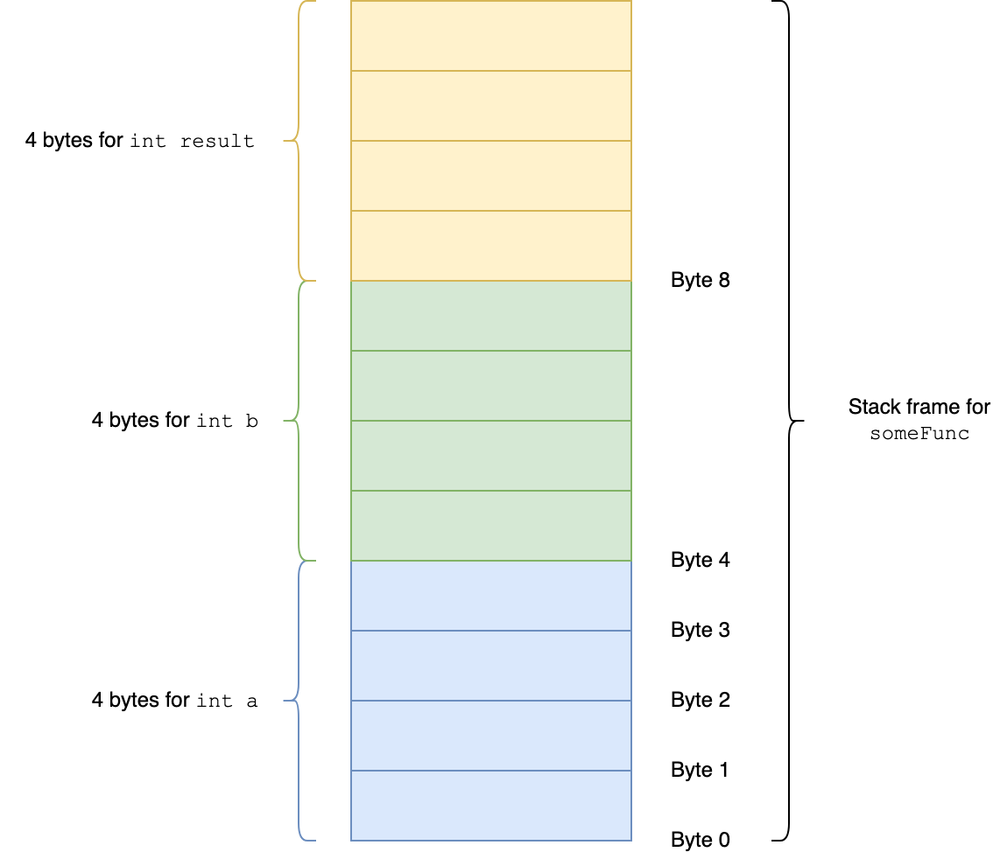
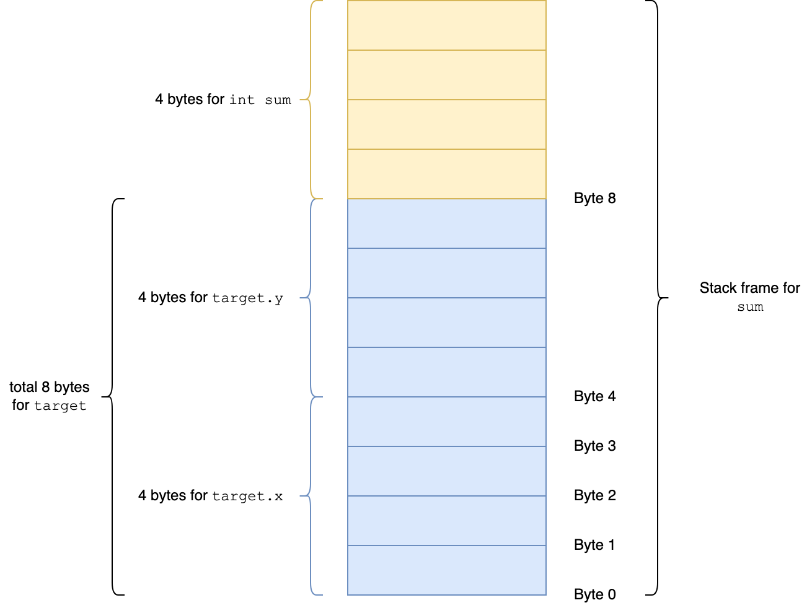
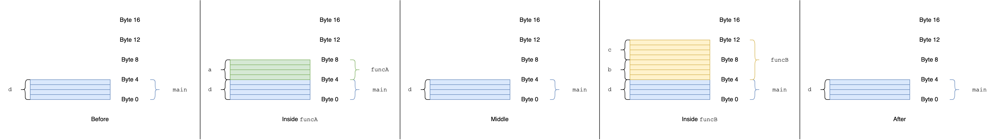
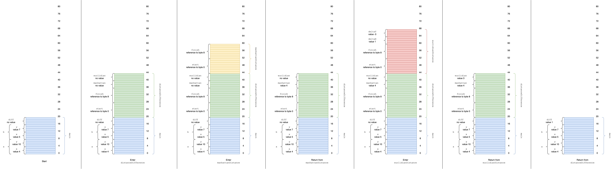

# Memory Layout

## Learning Objectives

By the end of this lesson you will be able to:

- First Objective
- [at least one]
- [no more than four]

## Lesson Content

We've talked a lot about the stack and the heap already this week. Let's dive into

In general the question we're trying to answer in this section is:

> When I create or use a variable, what happens in my program's memory space?

This discussion is a pretty good approximation of what's really going on. We're hitting the important concepts and glossing over some of the details. This should give you a solid foundation to build on. The goal is, if you were to inspect the memory layout of a running process, you would be able to say "ok, there's the bits we talked about, and a couple of other things that I haven't learned about yet, but I pretty much understand what's going on".

Finally, when we talk about the stack and the heap in this section, we mean the function call stack and the program heap. We are NOT talking about the data structures, unless we explicitly say so.

### Memory Model

To give us some context, let's talk a bit about how memory works.

We know that all data in a computer is composed of 1s and 0s. Each 1 or 0 is called a bit. At the hardware level, memory is basically a whole bunch of cells, each of which holds a 1 or a 0.

A single 1 or 0 isn't very useful by itself, so these cells are organized into groups of 8, called "bytes". These 8 ones and zeros are enough that you can use binary to store numbers, which you can then translate into letters, boolean values, or whatever. **At the hardware level, bytes are the basic units of memory**.

If a byte isn't big enough you can group 2, 4 or 8 (or more!) bytes to get a "word" of 16, 32 or 64 bits. These are used for things like unicode characters (16 or 32 bits) and floating point numbers (64 bits). But, as far as this explanation is concerned, a word is just a sequence of bytes.

Each byte of memory has an "address". This address is an integer, which means memory acts like a giant 1-dimensional array. Instructions to the processor are things like "add the data at byte 1234 to the data at byte 7890 and store the result at byte 4242", or "copy 512 bytes starting at byte 3456 to the space starting at byte 5678".

How much space does an address take? Depends on your hardware, but most modern computers take 64 bits (8 bytes) for an address (this is what's meant by a 64 bit processor).

## TODO picture of data in memory with addresses

Since addresses are integers, this also means **we can store addresses as data**. We call this a "pointer" or "reference", since one piece of memory "points to" or "references" another. This means we can have instructions like "add the byte at the memory location referenced by byte 1234 to...". References are the key to building more complex structures out of memory.

## TODO picture of memory with references

It's worth emphasizing that the **hardware doesn't care what type our data has**. Any particular byte could be an integer, a boolean, part of a floating point number, or a reference, and it gets treated the same. Types are restrictions imposed by the compiler to help us avoid mistakes.

In summary:

- Memory is organized into 8-bit bytes
- Each byte has an integer address, so memory acts like a big 1D array
- A pointer or reference is when you store a byte's address as data
- Hardware doesn't care about types

These rules are defined by your computer's hardware and operating system, so they're going to be true for any programming language you work in. Each language is going to use these basic structures in different ways, so let's dive into that next.

### Memory Layout in Traditional Languages

"Traditional languages" is a pretty vague category - let's start by narrowing that down. In this section we will specifically discuss languages that are:

- Statically typed
- Compiled

That means our list includes "old" languages like C, C++ and Java, as well as newer languages like Go, Rust and Swift. It does not include dynamic interpreted languages like Python, Ruby or JavaScript.

For this discussion, we'll use a simplified language called NQC (not quite C) that's pretty similar to C but skips some of the more painful hoops the C compiler makes you jump through.

These languages break their memory layout into two sections, the stack and the heap.

### The Stack

#### Local Variables

The stack is used to track local variables. Consider the following function definition in NQC:

```c
int someFunc() {
  int a = 42;
  int b = 106;
  int result = a + b;
  return result;
}
```

The compiler knows how many bytes each variable needs, so it lays them out one by one in memory, keeping track of where each one starts.

The code above needs 3 variables, each of which is an integer (32 bits), so memory would be laid out as follows:



In addition to built-in types, most languages let you define custom types by composing other types. In NQC this takes the form of a `struct`:

```c
struct Point {
  int x;
  int y;
};

int sum() {
  struct Point target;
  target.x = 5;
  target.y = 8;

  int sum = target.x + target.y;
  return sum;
}
```



You can put arrays on the stack too, as long as they have a fixed size. The compiler allocates enough space for that many of the variable, one after the other.

```c
struct Point { /* ... */ };

int main() {
  struct Point points[3];
}
```


The compiler also stores some extra info for each function, like parameter values and where the function should return to when its done. The space needed to store all the variables and extra info for a function is called a _stack frame_.

#### Stack Frames

Every time a function is called, the compiler grabs enough memory space for its stack frame. Where does this space come from?

It comes from the end of a region of memory called the stack.

The stack starts out empty, and each time we call a function we expand the stack by one frame. We call this "pushing" to the stack.

When we return from a function, we remove its frame from the stack, so the stack shrinks. We call this "popping" from the stack.

This makes it clear why the stack is called the stack: it's implemented as a stack data structure!

Here is a simple example in NQC:

```c
void funcA () {
  int a = 1234;
}

void funcB () {
  int b = 3456;
  int c = 5678;
}

void main () {
  int d = 7890;
  // Before
  funcA();
  // Middle
  funcB();
  // After
}
```



_Learn doesn't do great with wide images. Right click -> view image to see full size._

And a slightly more complex example:

```c
struct Point {
  int x;
  int y;
};

// A * after a type makes the type a pointer
// The caller will pass in the address of start and finish
// instead of copying the values
int manhattanDistance(Point* start, Point* finish) {
  return = abs(start.x - finish.x) + abs(start.y - finish.y);
}

int euclidianDistance(Point* start, Point* finish) {
  int deltaX = start.x - finish.x;
  int deltaY = start.y - finish.y;
  return = sqrt(deltaX * deltaX + deltaY * deltaY)
}

// Since start and finish are already pointers, we don't
// need to use & again here
int distanceDifference(Point* start, Point* finish) {
  int manhattan = manhattanDistance(start, finish);
  int euclidian = euclidianDistance(start, finish);
  return manhattan - euclidian;
}

void main() {
  Point a = { x: 4, y: 10 };
  Point b = { x: 5, y: 7 };

  // & before a variable name creates a pointer to that variable
  // This allows us to pass by reference
  int diff = distanceDifference(&a, &b);
}
```



#### Stack Pros and Cons

The stack is great because it's simple. Each function keeps track of exactly the memory it needs, and when it's done that memory is returned to the pool. There's no way to leak memory!

This simplicity also makes for easy optimizations like [memory caching](https://searchstorage.techtarget.com/definition/cache-memory) and [prefetching](https://en.wikipedia.org/wiki/Cache_prefetching).

The downside of the stack is that objects can't outlive the function that creates them. This is fine for simple programs, but most real-world programs usually need some sort of dynamic, long-lived memory.

In addition, most compilers put a strict limit on the maximum size of a program's call stack, [typically around 1MB](https://stackoverflow.com/questions/1825964/c-c-maximum-stack-size-of-program) for modern systems. Exceeding this limit results in a "stack overflow" error.

### The Heap


#### Heap Pros and Cons

Pros:

- "Unlimited" size (all of main memory + swap file)
- Data can be as long-lived as the program

Cons:

- Memory cleanup is more complex, need either manual free, garbage collection, or something like Rust's ownership model
- May be significantly slower than something allocated on the stack

### Review: Stack vs Heap

| Property        | Stack                               | Heap                                      |
| --------------- | ----------------------------------- | ----------------------------------------- |
| Max size        | ~1MB                                | "Unlimited"                               |
| Speed           | Fast                                | Maybe slower, especially for big programs |
| Object lifetime | Goes away when the function returns | Until freed / dereferenced                |
| Memory cleanup  | Simple: pop a stack frame           | Complex: manual free / GC                 |

### Memory Layout in JavaScript

The ECMA spec doesn't say _anything_ about how memory should be laid out. This is great because it gives JS engines tons of leeway to optimize code, and JavaScript is surprisingly fast as a result. But it does make our analysis more complex (and engine-dependent).

What follows is targeted specifically at V8. Between Chrome, Edge (r.i.p. Chakra), Node and Electron V8 has far-and-away the biggest market share, and it's therefore easier to find documentation about. As far as this author can tell, SpiderMonkey (Firefox) follows basically the same pattern.

In practice, the fundamentals of memory management in JavaScript are similar to more traditional languages:

- When you call a function a frame is added to the stack with enough room for all the function's local variables (primitives or references)
- `Object` and `Array` types are allocated dynamically on the heap, and a reference to that object is stored on the stack

The key difference is that unlike with traditional languages, the programmer has no control over where an object is allocated. You can't elect to put a small array or object on the stack - the interpreter chooses for you, and generally it will choose the heap.

That means that the following C code + memory layout

```c
struct HeapRecord {
  int priority;

  // In C, adding * to a type gives you a reference
  // In other words, element is stored somewhere else, probably on the heap
  // void* is a generic reference, meaning we don't know the type of element
  void* element;
};

struct HeapDS {
  int count;

  // The heap's storage is not a reference (no * in the type),
  // which means it's an inline array
  struct HeapRecord[1024] storage;
};

int main (char** args) {
  // Allocate a heap as a local variable (on the stack)
  struct HeapDS priorityQueue;
  priorityQueue.count = 0;

  // ... use the heap ...
}
```

Translated into JavaScript would have a very different memory layout

```js
const main = () => {
  // Objects are always allocated on the heap
  const priorityQueue = {
    count: 0,
    storage: [],
  };
  for (let i = 0; i < 1024; i += 1) {
    priorityQueue.storage.push({ priority: undefined, element: undefined });
  }
};
```

#### Complications

JavaScript has two features that complicate this.

First, JS is dynamically typed

- Variables can change type mid-function
- We don't know how much space something will take up until runtime

Second, JS has 2 compilers, the interpreter and the optimizing compiler

| Compiler            | Goal             | Pattern                                                                                                              |
| ------------------- | ---------------- | -------------------------------------------------------------------------------------------------------------------- |
| Interpreter         | Fast compilation | Stack/heap as above                                                                                                  |
| Optimizing compiler | Fast execution   | Aggressive changes, including but not limited to locking down types, inlining functions and moving data to the stack |

Neither of these will affect the basics of our analysis. The optimizing compiler in particular sounds scary, but since it generally makes things better and not worse, we can mostly ignore it.

Still, if you're staring at the profiler trying to figure out what's going on, these are good to know about, at least so you have a place to start in doing more research.

### Vocab

Bit
Byte
Word
Address
Pointer or reference
Stack
Stack frame

### Additional Reading

- [A crash course in just-in-time (JIT) compilers](https://hacks.mozilla.org/2017/02/a-crash-course-in-just-in-time-jit-compilers/) by Lin Clark of Mozilla - if you read nothing else, read this
- [Does JavaScript use stack or heap for memory allocation or both?](https://hashnode.com/post/does-javascript-use-stack-or-heap-for-memory-allocation-or-both-cj5jl90xl01nh1twuv8ug0bjk)
- [References and Values](https://github.com/Ada-Developers-Academy/textbook-curriculum/blob/master/02-intermediate-ruby/references-and-values.md) from the Ada classroom curriculum

## Challenges

[It's recommended that each lesson has at least one challenge. Challenges make the content interactive and give instructors visibility into student learning. These challenge can be spread out in between content, or can be at the end of the lesson. Examples of all challenge types are in this unit -- https://learn-2.galvanize.com/cohorts/667/blocks/13/content_files/Multiple-Choice-Challenge.md]
