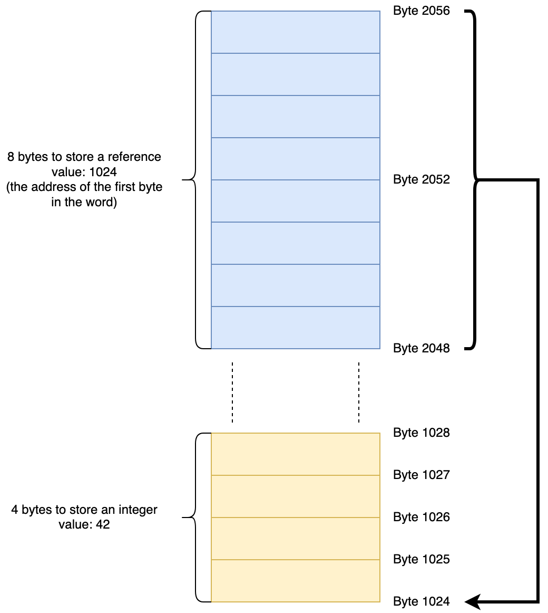
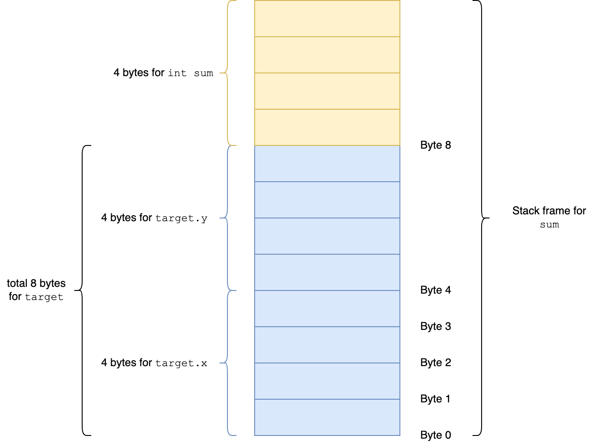
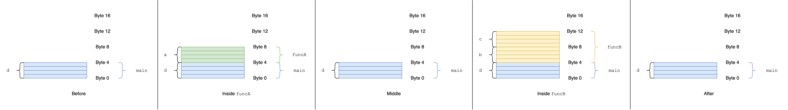
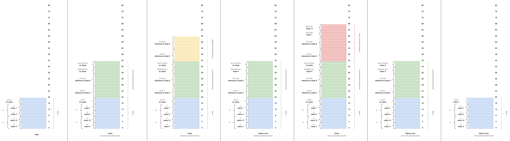
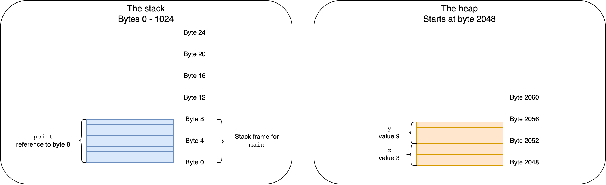
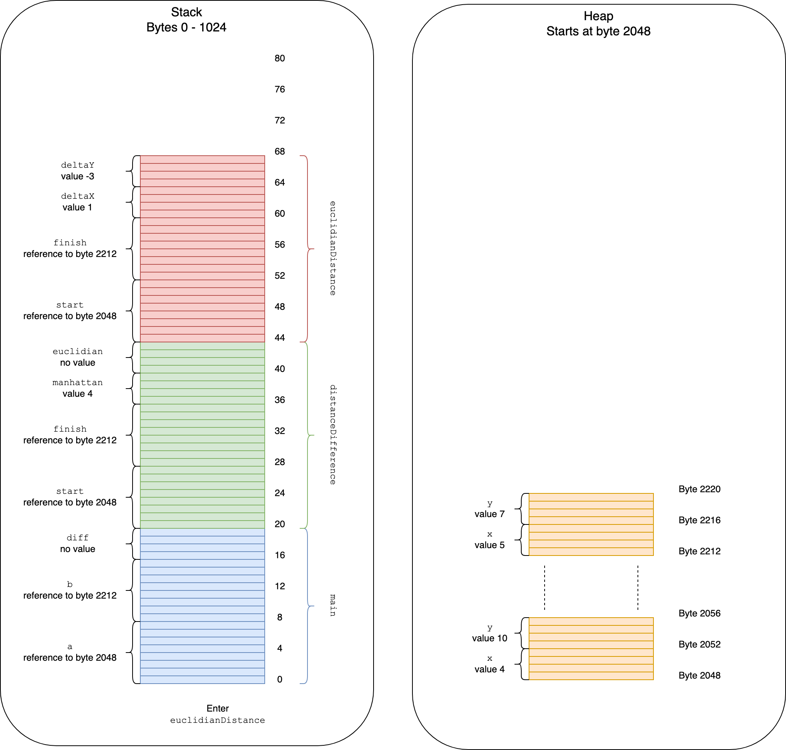
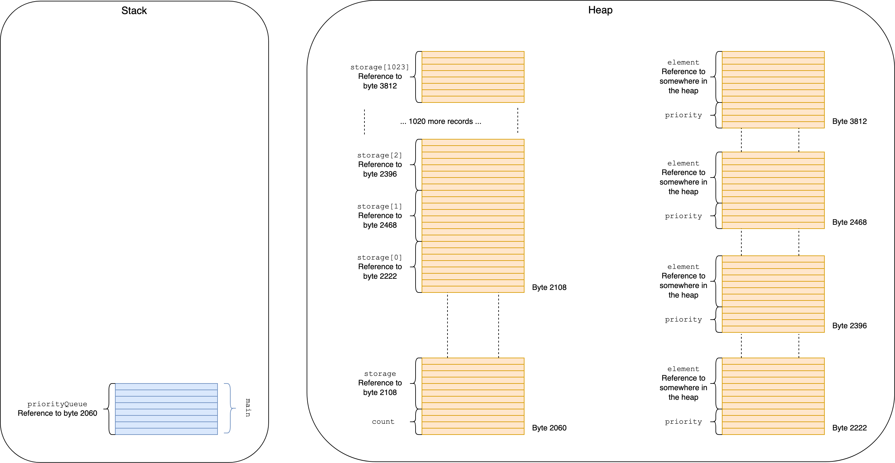
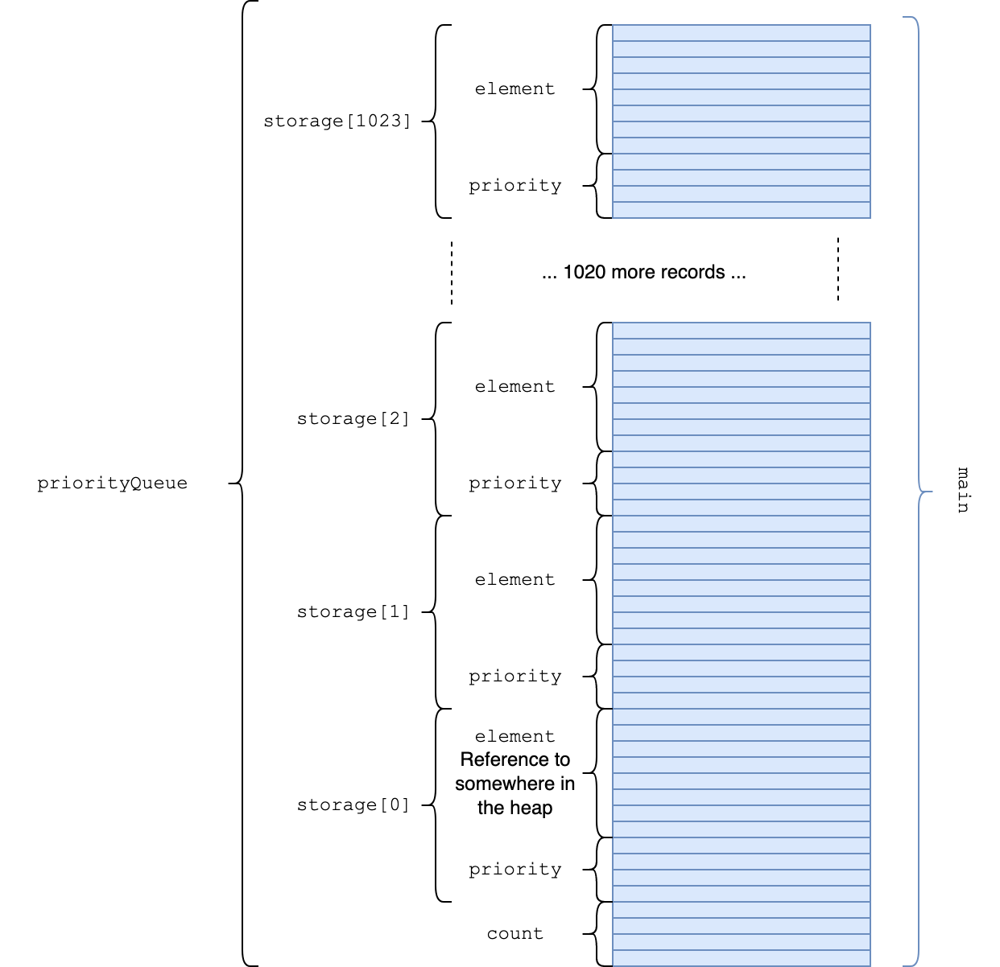

# Supplement: Memory Layout

This section is optional. You don't strictly need it for our discussion of data structures, but it helps give context to some of what we're doing. Plus, it's interesting!

## Learning Objectives

By the end of this lesson, students will be able to...

* **Define** the following terms: bit, byte, word, address, pointer, reference, call stack, stack frame, program heap, allocate
* **Describe** how addresses and references allow a program to link regions of memory together
* **Differentiate** between the call stack and the program heap
* **Explain** what all this has to do with the heap data structure

## Lesson Content

We've talked a lot about the stack and the heap already this week. Let's dive into these concepts a little more.

In general the question we're trying to answer in this section is:

> When I create or use a variable, what happens in my program's memory space?

This discussion is a pretty good approximation of what's really going on. We're hitting the important concepts and glossing over some of the details. This should give you a solid foundation to build on. The goal is, if you were to inspect the memory layout of a running process, you would be able to say "ok, there's the bits we talked about, and a couple of other things that I haven't learned about yet, but I pretty much understand what's going on".

Finally, when we talk about the stack and the heap in this section, we mean the function call stack and the program heap. We are NOT talking about the data structures, unless we explicitly say so.

### Memory Model

To give us some context, let's talk a bit about how memory works.

We know that all data in a computer is composed of 1s and 0s. Each 1 or 0 is called a "bit". At the hardware level, memory is basically a whole bunch of cells, each of which holds a 1 or a 0.

A single 1 or 0 isn't very useful by itself, so these cells are organized into groups of 8, called "bytes". These 8 ones and zeros are enough that you can use binary to store numbers, which you can then translate into letters, boolean values, or whatever. **At the hardware level, bytes are the basic units of memory**.

If a byte isn't big enough you can group 2, 4 or 8 (or more!) bytes to get a "word" of 16, 32 or 64 bits. These are used for things like unicode characters (16 or 32 bits), larger integers (32 bits) and floating point numbers (64 bits). But, as far as this explanation is concerned, a word is just a sequence of bytes.

Each byte of memory has an "address". This address is an integer, which means memory acts like a giant 1-dimensional array. Instructions to the processor are things like "add the data at byte 1234 to the data at byte 7890 and store the result at byte 4242", or "copy 512 bytes starting at byte 3456 to the space starting at byte 5678".

Since addresses are integers, this also means **we can store addresses as data**. We call this a "pointer" or "reference", since one piece of memory "points to" or "references" another. This means we can have instructions like "add the byte at the memory location referenced by byte 1234 to...". References are the key to building more complex structures out of memory.

How much space does an address take? Depends on your hardware, but most modern computers take 64 bits (8 bytes) for an address. This is what's meant by a 64 bit processor. That means a modern computer can address up to \\(2^64 = 1.84e19\\) bytes of memory, or about 18 billion gigabytes. That's probably enough, right?

**Question:** How many bytes of memory can you address with 32 bit pointers?



_If the variable you're referencing is small like an integer, the reference actually takes up more space! References to bigger chunks of memory like arrays are more useful._

It's worth emphasizing that the **hardware doesn't care what type our data has**. Any particular byte could be an integer, a boolean, part of a floating point number, or a reference, and it gets treated the same. Types are restrictions imposed by the compiler to help us avoid mistakes.

In summary:

* Memory is organized into 8-bit bytes
* Each byte has an integer address, so memory acts like a big 1D array
* A pointer or reference is when you store a byte's address as data
* Hardware doesn't care about types

These rules are defined by your computer's hardware and operating system, so they're going to be true for any programming language you work in. Each language is going to use these basic structures in different ways, so let's dive into that next.

<!-- >>>>>>>>>>>>>>>>>>>>>> BEGIN CHALLENGE >>>>>>>>>>>>>>>>>>>>>> -->

### !challenge

* type: multiple-choice
* id: 07de51bc-6747-4310-a5d7-1e84f3219476
* title: Memory units

##### !question

What is the basic unit of memory? In other words, if you have an address, what size of memory is it pointing to?

##### !end-question

##### !options

* A bit (a single 1 or 0)
* A byte (8 bits)
* A word (2, 4, or 8 bytes)

##### !end-options

##### !answer

* A byte (8 bits)

##### !end-answer

### !end-challenge

<!-- ======================= END CHALLENGE ======================= -->

<!-- >>>>>>>>>>>>>>>>>>>>>> BEGIN CHALLENGE >>>>>>>>>>>>>>>>>>>>>> -->

### !challenge

* type: multiple-choice
* id: 5c89b503-5d2c-424b-b571-cb5933ff1fbe
* title: References

##### !question

What is a reference?

##### !end-question

##### !options

* An 8-byte word
* Data that's too big to fit in the current space, so the program puts it somewhere else
* A piece of memory that stores the address of another piece of memory, so that your program can "jump" from one spot to another

##### !end-options

##### !answer

* A piece of memory that stores the address of another piece of memory, so that your program can "jump" from one spot to another

##### !end-answer

### !end-challenge

<!-- ======================= END CHALLENGE ======================= -->

### Memory Layout in Traditional Languages

"Traditional languages" is a pretty vague category - let's start by narrowing that down. In this section we will specifically discuss languages that are:

* Statically typed
* Compiled

That means our list includes "old" languages like C, C++ and Java, as well as newer languages like Go, Rust and Swift. It does not include dynamic interpreted languages like Python, Ruby or JavaScript.

For this discussion, we'll use a simplified language called NQC (not quite C) that's pretty similar to C but skips some of the more painful hoops the C compiler makes you jump through.

These languages break their memory layout into two sections, the stack and the heap.

### The Stack

#### Local Variables

The stack is used to track local variables. Consider the following function definition in NQC:

```c
int someFunc() {
  int a = 42;
  int b = 106;
  int result = a + b;
  return result;
}
```

The compiler knows how many bytes each variable needs, so it lays them out one by one in memory, keeping track of where each one starts.

The code above needs 3 variables, each of which is an integer (32 bits), so memory would be laid out as follows:


In addition to built-in types, most languages let you define custom types by composing other types. In NQC this takes the form of a `struct` (think of a class with no methods):

```c
struct Point {
  int x;
  int y;
};

int sum() {
  struct Point target;
  target.x = 5;
  target.y = 8;

  int sum = target.x + target.y;
  return sum;
}
```



You can put arrays on the stack too, as long as they have a fixed size. The compiler sets aside enough space for that many of the variable, one after the other.

```c
struct Point { /* ... */ };

int main() {
  struct Point points[3];
}
```


The compiler also stores some extra info for each function, like argument values and where the function should return to when it's done. The space needed to store all the variables and extra info for a function is called a _stack frame_.

#### Stack Frames

Every time a function is called, the compiler grabs enough memory space for its stack frame. Where does this space come from?

It comes from the end of a region of memory called the stack.

The stack starts out empty, and each time we call a function we expand the stack by one frame. We call this "pushing" to the stack.

When we return from a function, we remove its frame from the stack, so the stack shrinks. We call this "popping" from the stack.

This makes it clear why the stack is called the stack: it's implemented as a stack data structure!

Here is a simple example in NQC:

```c
void funcA () {
  int a = 1234;
}

void funcB () {
  int b = 3456;
  int c = 5678;
}

void main () {
  int d = 7890;
  // Before
  funcA();
  // Middle
  funcB();
  // After
}
```



_Learn doesn't do great with wide images. Right click -> view image to see full size._

And a slightly more complex example:

```c
struct Point {
  int x;
  int y;
};

// A * after a type makes the type a pointer
// The caller will pass in the address of start and finish
// instead of copying the values
int manhattanDistance(Point* start, Point* finish) {
  return = abs(start.x - finish.x) + abs(start.y - finish.y);
}

int euclidianDistance(Point* start, Point* finish) {
  int deltaX = start.x - finish.x;
  int deltaY = start.y - finish.y;
  return = sqrt(deltaX * deltaX + deltaY * deltaY)
}

// Since start and finish are already pointers, we don't
// need to use & again here
int distanceDifference(Point* start, Point* finish) {
  int manhattan = manhattanDistance(start, finish);
  int euclidian = euclidianDistance(start, finish);
  return manhattan - euclidian;
}

void main() {
  Point a = { x: 4, y: 10 };
  Point b = { x: 5, y: 7 };

  // & before a variable name creates a pointer to that variable
  // This allows us to pass by reference
  int diff = distanceDifference(&a, &b);
}
```



A potentially confusing feature of this program is that our references (always 8 bytes) are the same size as our `Point` struct (two 4-byte integers). If we were to increase the size of a `Point` (for example by adding a `z` coordinate) the storage required in the blue `main` stack frame would increase, but the size of the references in the other functions would not.

#### Stack Pros and Cons

The stack is great because its rules are well defined and use patterns are relatively simple. Each function keeps track of exactly the memory it needs, and when it's done that memory is returned to the pool. There's no way to leak memory!

This simplicity also makes for easy optimizations like [memory caching](https://searchstorage.techtarget.com/definition/cache-memory) and [prefetching](https://en.wikipedia.org/wiki/Cache_prefetching).

The downside of the stack is that objects can't outlive the function that creates them. This is fine for simple programs, but most real-world programs usually need some sort of dynamic, long-lived memory.

In addition, most compilers put a strict limit on the maximum size of a program's call stack, [typically around 1MB](https://stackoverflow.com/questions/1825964/c-c-maximum-stack-size-of-program) for modern systems. Exceeding this limit (through infinite recursion or by allocating something really big on the stack) results in a "stack overflow" error.

<!-- >>>>>>>>>>>>>>>>>>>>>> BEGIN CHALLENGE >>>>>>>>>>>>>>>>>>>>>> -->

### !challenge

* type: multiple-choice
* id: 8911158e-0980-4c71-8ea6-342992ae0c59
* title: Stack contents

##### !question

What does a stack frame contain?

##### !end-question

##### !options

* A function's arguments
* All the local variables needed by a function
* Extra info like where the function should return to when it's done
* All of the above

##### !end-options

##### !answer

* All of the above

##### !end-answer

### !end-challenge

<!-- ======================= END CHALLENGE ======================= -->

<!-- >>>>>>>>>>>>>>>>>>>>>> BEGIN CHALLENGE >>>>>>>>>>>>>>>>>>>>>> -->

### !challenge

* type: multiple-choice
* id: 76ab6830-17bc-4f27-a746-88cb66c6a4e2
* title: Reclaiming the stack

##### !question

How does a program know that memory on the stack is no longer in use, so it can be safely reused for something else?

##### !end-question

##### !options

* A garbage collector automatically searches for and reclaims unused memory
* The programmer needs to manually mark memory as no longer in use
* When a function finishes it "pops" its stack frame, and that space is immediately available for use
* Memory allocated for a stack frame will be in use for the rest of the program, so it doesn't need to be reclaimed

##### !end-options

##### !answer

* When a function finishes it "pops" its stack frame, and that space is immediately available for use

##### !end-answer

### !end-challenge

<!-- ======================= END CHALLENGE ======================= -->

<!-- >>>>>>>>>>>>>>>>>>>>>> BEGIN CHALLENGE >>>>>>>>>>>>>>>>>>>>>> -->

### !challenge

* type: checkbox
* id: 0c5fe916-f7ee-4c58-babc-ba0db127f17a
* title: Stack disadvantages

##### !question

Which of the following are disadvantages of the stack

##### !end-question

##### !options

* Allocating a new stack frame is slow
* Accessing data on the stack is slow
* The stack has a relatively small (~1MB) maximum capacity
* Cleaning up unused memory on the stack is complicated
* Objects on the stack cannot outlive the function that created them

##### !end-options

##### !answer

* The stack has a relatively small (~1MB) maximum capacity
* Objects on the stack cannot outlive the function that created them

##### !end-answer

<!-- other optional sections -->
<!-- !hint - !end-hint (markdown, users can see after a failed attempt) -->
<!-- !rubric - !end-rubric (markdown, instructors can see while scoring a checkpoint) -->
<!-- !explanation - !end-explanation (markdown, students can see after answering correctly) -->

### !end-challenge

<!-- ======================= END CHALLENGE ======================= -->

### The Heap

When a program needs to create objects that are long-lived or that take more than a small amount of memory, it can put them in a different region of memory called the heap. Objects on the heap are accessed through references, stored either on the stack or in another heap object.

```c
void main() {
  Point* point = new Point(x: 3, y: 9);
}
```



_Note that the numbers for where the stack and heap start and end are made up - a real process would have very different numbers_

The process of "grabbing memory" from the heap to use for an object is called _allocation_.

How do you know something's being allocated on the heap? Any time you see the keyword `new`. Remember that in most languages, syntactic sugar for hash / array creation is a wrapper for something like `new Hash` or `new Array`.

Like the stack, individual blocks of memory allocated on the heap are always contiguous. Unlike the stack, the address of any given block is not predictable - you get what you get, wherever it happens to lie in memory.

#### Heap Pros and Cons

##### Size and Speed

The heap is typically several orders of magnitude larger than the stack, maxing out at tens or hundreds of GB instead of a single MB. This is due to convenience, not any fundamental principle of computer science. Lots of time and research have shown that having a small stack and a large heap is the most useful thing for most programs.

As a result, **most programs store most of their objects on the heap**.

Access to the heap always goes through at least one extra layer of indirection (you have to resolve a reference on the stack first), so even in the best case the heap is slightly slower than the stack. Furthermore, because the heap is big and access is essentially random, it benefits somewhat less from caching and prefetching than the stack does. The difference usually isn't large, but it is there.

##### Flexibility

While the stack has lots of rules governing how it works, the heap is relatively unstructured. Your program asks for a certain amount of memory, and the compiler blocks it off and hands you back a reference. Your program is then free to do whatever it likes with it.

The downside of this flexibility is that cleaning up memory becomes more complicated. Since we've decoupled our objects from the functions that created them, there's no obvious way to tell when that memory can be safely recycled.

There are a few strategies for dealing with this:

* Make programmers **manually free memory** (C, C++, etc.)
* Use a **garbage collector** to periodically find and reclaim unused memory (Java, Python, Ruby, Go, JavaScript, etc.)
* Use an **object ownership model** (Rust)

No matter which scheme your language uses, reclaiming heap memory is more complicated than reclaiming stack memory.

<!-- >>>>>>>>>>>>>>>>>>>>>> BEGIN CHALLENGE >>>>>>>>>>>>>>>>>>>>>> -->

### !challenge

* type: checkbox
* id: 56d51d16-058f-4451-a577-0f7479565bec
* title: Heap advantages

##### !question

What are the main advantages of allocating objects on the heap instead of the stack?

##### !end-question

##### !options

* The heap can be much bigger than the stack
* The heap is faster than the stack
* Objects allocated on the heap can live longer than the function that created them
* Finding and reclaiming unused heap memory is simpler

##### !end-options

##### !answer

* The heap can be much bigger than the stack
* Objects allocated on the heap can live longer than the function that created them

##### !end-answer

### !end-challenge

<!-- ======================= END CHALLENGE ======================= -->

### Review: Stack vs Heap

| Property        | Stack                               | Heap                                               |
| --------------- | ----------------------------------- | -------------------------------------------------- |
| Max size        | ~1MB                                | "Unlimited"                                        |
| Speed           | Fast                                | Maybe slower, especially for big programs          |
| Object lifetime | Goes away when the function returns | Until freed / dereferenced                         |
| Memory cleanup  | Simple: pop a stack frame           | Complex: manual free / GC / something experimental |

### Memory Layout in JavaScript

The ECMA spec doesn't say _anything_ about how memory should be laid out. This is great because it gives JS engines tons of leeway to optimize code, and JavaScript is surprisingly fast as a result. But it does make our analysis more complex (and engine-dependent).

In practice, the fundamentals of memory management in JavaScript are similar to more traditional languages:

* When you call a function a frame is added to the stack with enough room for all the function's local variables (primitives or references)
* `Object` and `Array` types are allocated dynamically on the heap, and a reference to that object is stored on the stack

The key difference is that unlike with traditional languages, the programmer has no control over where an object is allocated. You can't elect to put a small array or object on the stack - the interpreter chooses for you, and generally it will choose the heap.

If we were to translate our NQC point distance program from before into JavaScript, we might end up with something like the following:

```js
const manhattanDistance = (start, finish) => {
  return = Math.abs(start.x - finish.x) + Math.abs(start.y - finish.y);
}

const euclidianDistance = (start, finish) => {
  const deltaX = start.x - finish.x;
  const deltaY = start.y - finish.y;
  return = Math.sqrt(deltaX * deltaX + deltaY * deltaY)
}

const distanceDifference = (start, finish) => {
  const manhattan = manhattanDistance(start, finish);
  const euclidian = euclidianDistance(start, finish);
  return manhattan - euclidian;
}

const main = () => {
  const a = { x: 4, y: 10 };
  const b = { x: 5, y: 7 };

  // JS always passes objects by reference, so there's no
  // need for us to specify with an &
  const diff = distanceDifference(a, b);
}
```



Dynamic typing and the JIT compiler make the reality of memory layout in JS a little more complex. However, the intuition that "objects and arrays live on the heap" is generally sound.

<!-- >>>>>>>>>>>>>>>>>>>>>> BEGIN CHALLENGE >>>>>>>>>>>>>>>>>>>>>> -->
<!-- Replace everything in square brackets [] and remove brackets  -->

### !challenge

* type: multiple-choice
* id: 8f34e5cd-6fe5-4c5a-83b6-4f5df8aba3c2
* title: JS Objects

##### !question

When you create an object or array in JavaScript, where is it allocated?

##### !end-question

##### !options

* The stack
* The heap

##### !end-options

##### !answer

* The heap

##### !end-answer

### !end-challenge

<!-- ======================= END CHALLENGE ======================= -->

### Takeaway: Heaps on the Stack

So what does all this have to do with our discussion of heap data structures?

Because our heap data structure has a small fixed size, we could plausibly allocate it on the call stack instead of the program heap. This doesn't work in JavaScript because we don't have control over where things are allocated, but in Java, C, or Rust it might work out to a noticeable performance boost.

Here's what the memory layout of our heap data structure might look like in JavaScript:



There's a lot of references there, which means that accessing records takes a lot of steps.

Here's a stack-based implementation in NQC:

```c
struct HeapRecord {
  int priority;
  // void* is a pointer to an unknown type. It's the C equivalent of using generics.
  // All pointers have the same size so it works out.
  void* element;
};

struct HeapDataStructure {
  int count;
  HeapRecord storage[1024];
};

void main() {
  HeapDataStructure priorityQueue;
  // ... some algorithm that uses a priority queue (maybe A*) ...
}
```



Putting everything in one contiguous block like that means there's a lot less references to resolve, which in turn will make our data structure faster. Clustering the data together also makes it easier to cache - in reality, this would probably be the biggest performance win.

Allocating our NQC heap DS on the program heap (via `new`) would have a similar result, with just one extra reference to resolve per lookup.

The key observation is that **this performance win only works because a heap data structure is a big block of contiguous memory**. With a linked tree like a red-black tree this doesn't work - each node is a separate object, and we have no knowledge of how they'll be laid out in memory.

### Vocab

| Term                 | Definition                                                                         |
| -------------------- | ---------------------------------------------------------------------------------- |
| Bit                  | A single 1 or 0                                                                    |
| Byte                 | 8 bits, the basic unit of memory                                                   |
| Word                 | 2, 4 or 8 bytes used to store a more complex value                                 |
| Address              | Integer representing the location of a byte in memory, like an index into an array |
| Pointer or reference | An address stored in memory, so that it "points to" another place in memory        |
| Call Stack                | Highly-structured region of memory used to hold local variables                    |
| Stack frame          | The space on the stack used by one function                                        |
| Program Heap                 | Unstructured region of memory used to hold objects                                 |
| Allocate             | Create an object on the heap                                                       |

### Additional Reading

* [A crash course in just-in-time (JIT) compilers](https://hacks.mozilla.org/2017/02/a-crash-course-in-just-in-time-jit-compilers/) by Lin Clark of Mozilla - if you have time to read only one thing, read this
* [Does JavaScript use stack or heap for memory allocation or both?](https://hashnode.com/post/does-javascript-use-stack-or-heap-for-memory-allocation-or-both-cj5jl90xl01nh1twuv8ug0bjk)
* [References and Values](https://github.com/Ada-Developers-Academy/textbook-curriculum/blob/master/02-intermediate-ruby/references-and-values.md) from the Ada classroom curriculum
