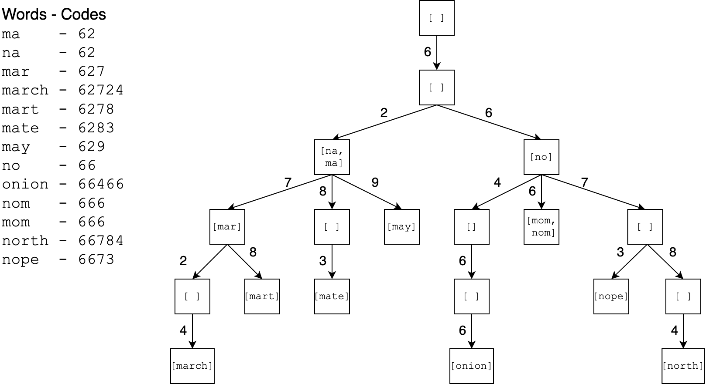

# Trie Implementation

## Learning Goals

By the end of this module, students will be able to...

* **Identify** features of other data structures relevant to implementing a prefix dictionary
* **Describe** the structure of a trie
* **Explain** how the lookup and insert operations work on a trie

## Lesson Content

<iframe src="https://adaacademy.hosted.panopto.com/Panopto/Pages/Embed.aspx?id=74a15fd7-e7dd-485e-918b-abd0017f77fe&autoplay=false&offerviewer=true&showtitle=true&showbrand=false&start=0&interactivity=all" width=720 height=405 style="border: 1px solid #464646;" allowfullscreen allow="autoplay"></iframe>

### Summary

- Each node has one child for each radix in our code alphabet
    - This number is the trie's **branching factor**
- Each node stores a list of words matching that code
- To lookup by code, walk down the trie one radix at a time
    - Lookup by prefix: lookup, then gather all matches in the subtree
    - Insert: lookup but create missing nodes

## Challenges

<!-- >>>>>>>>>>>>>>>>>>>>>> BEGIN CHALLENGE >>>>>>>>>>>>>>>>>>>>>> -->
<!-- Replace everything in square brackets [] and remove brackets  -->

### !challenge

* type: multiple-choice
* id: 3cd0ff1c-20c2-4f3b-a17b-c0f5f767accf
* title: Trie Nodes

##### !question

What does a trie node store?

##### !end-question

##### !options

* A word
* A list of words
* A code and a word
* A code and a list of words

##### !end-options

##### !answer

* A list of words

##### !end-answer

### !end-challenge

<!-- ======================= END CHALLENGE ======================= -->
<!-- >>>>>>>>>>>>>>>>>>>>>> BEGIN CHALLENGE >>>>>>>>>>>>>>>>>>>>>> -->
<!-- Replace everything in square brackets [] and remove brackets  -->

### !challenge

* type: multiple-choice
* id: ebe7326c-316a-44b6-9fca-e81d1eff0fa9
* title: Trie Children

##### !question

What is the max number of children for a trie node?

##### !end-question

##### !options

* 1
* 2
* 8
* 10
* One for each radix in the code alphabet

##### !end-options

##### !answer

* One for each radix in the code alphabet

##### !end-answer

### !end-challenge

<!-- ======================= END CHALLENGE ======================= -->

The next questions ask about the following trie.

<!-- >>>>>>>>>>>>>>>>>>>>>> BEGIN CHALLENGE >>>>>>>>>>>>>>>>>>>>>> -->
<!-- Replace everything in square brackets [] and remove brackets  -->

### !challenge

* type: multiple-choice
* id: 247ddc7d-5659-4162-8399-af4c12e33029
* title: Lookup Prefix

##### !question

What is the result of calling `lookupPrefix` with code `627` on the trie?

##### !end-question

##### !options

* `[march, mart]`
* `[mar, march, mart]`
* `[na, ma, mar, march, mart]`
* `[na, ma, mar, march, mart, mate, may]`

##### !end-options

##### !answer

* `[mar, march, mart]`

##### !end-answer

<!-- other optional sections -->
<!-- !hint - !end-hint (markdown, users can see after a failed attempt) -->
<!-- !rubric - !end-rubric (markdown, instructors can see while scoring a checkpoint) -->
<!-- !explanation - !end-explanation (markdown, students can see after answering correctly) -->

### !end-challenge

<!-- ======================= END CHALLENGE ======================= -->
<!-- >>>>>>>>>>>>>>>>>>>>>> BEGIN CHALLENGE >>>>>>>>>>>>>>>>>>>>>> -->
<!-- Replace everything in square brackets [] and remove brackets  -->

### !challenge

* type: multiple-choice
* id: a45ea7f4-1f66-4d67-8ae1-b30e2e64229e
* title: Insert

##### !question

How many nodes would be created when inserting the word "only" (code `6659`)?

##### !end-question

##### !options

* 0
* 1
* 2
* 3
* 4

##### !end-options

##### !answer

* 2

##### !end-answer

### !end-challenge

<!-- ======================= END CHALLENGE ======================= -->
