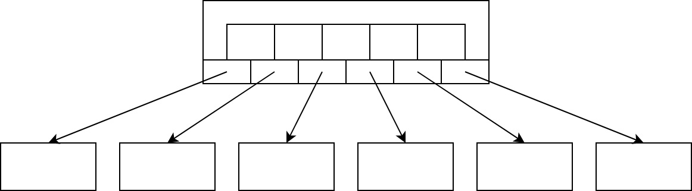

# B-Tree Design

## Learning Goals

By the end of this module, students will be able to...

- **Describe** the structure of a B-Tree node
- **Compare** the B-Tree property to the BST property
- **State** the height of a B-Tree in terms of the number of records

## Lesson Content

<iframe src="https://adaacademy.hosted.panopto.com/Panopto/Pages/Embed.aspx?id=7452fbea-4b43-4f78-a257-abdd01189311&autoplay=false&offerviewer=true&showtitle=true&showbrand=false&start=0&interactivity=all" width=720 height=405 style="border: 1px solid #464646;" allowfullscreen allow="autoplay"></iframe>

## Summary

The **degree** \\(d\\) of a non-leaf node is its number of children
- A node with \\(d\\) children stores \\(d-1\\) key-value pairs
- Leaf nodes have no children, but we still use \\(d-1\\) to describe the number of keys
- In our implementation, children, keys and values are stored in three parallel arrays

A B-Tree has **min degree** \\(t\\) and **max degree** \\(2t\\). The root may have less than \\(t\\) children, but all other nodes must have \\(t \leq d \leq 2t\\).

The **B-Tree property** is similar to the BST property:

>Let `node` be any non-leaf node. Then for each index \\(0 \leq i \lt d-1\\)...
>- All keys in the subtree at `node.children[i]` are less than `node.keys[i]`
>- All keys in the subtree at `node.children[i+1]` are greater than `node.keys[i]`

All **leaf nodes** have the same **depth**. This means that for a B-tree with \\(n\\) records, the height \\(h = O(log(n))\\).

## Challenges

For the following questions, consider a B-Tree with minimum degree \\(t = 3\\).

<!-- >>>>>>>>>>>>>>>>>>>>>> BEGIN CHALLENGE >>>>>>>>>>>>>>>>>>>>>> -->
<!-- Replace everything in square brackets [] and remove brackets  -->

### !challenge

* type: multiple-choice
* id: 873857de-7dd0-4880-9d99-f6f3330939b1
* title: Minimum children

##### !question

What is the minimum number of children for an _inner node_ in the tree?

By _inner node_ we mean a node that is neither the root nor a leaf.

##### !end-question

##### !options

* 0
* 1
* 2
* 3
* 4
* 5
* 6

##### !end-options

##### !answer

* 3

##### !end-answer

##### !hint

The _degree_ of a node is its number of children. If the minimum degree is 3, that's the minimum number of children.

##### !end-hint

### !end-challenge

<!-- ======================= END CHALLENGE ======================= -->
<!-- >>>>>>>>>>>>>>>>>>>>>> BEGIN CHALLENGE >>>>>>>>>>>>>>>>>>>>>> -->
<!-- Replace everything in square brackets [] and remove brackets  -->

### !challenge

* type: multiple-choice
* id: 579721d2-7e5e-46b8-b08f-14bd3a276e11
* title: Minimum keys

##### !question

What is the minimum number of key / value pairs for a node other than the root in the tree?

##### !end-question

##### !options

* 0
* 1
* 2
* 3
* 4
* 5
* 6

##### !end-options

##### !answer

* 2

##### !end-answer

##### !hint

A non-leaf node always has one fewer keys than children.

##### !end-hint

### !end-challenge

<!-- ======================= END CHALLENGE ======================= -->
<!-- >>>>>>>>>>>>>>>>>>>>>> BEGIN CHALLENGE >>>>>>>>>>>>>>>>>>>>>> -->
<!-- Replace everything in square brackets [] and remove brackets  -->

### !challenge

* type: multiple-choice
* id: c6a72c3a-f06f-4c94-90aa-f75311d37c70
* title: Maximum children

##### !question

What is the maximum number of children for a node in the tree?

##### !end-question

##### !options

* 0
* 1
* 2
* 3
* 4
* 5
* 6

##### !end-options

##### !answer

* 6

##### !end-answer

##### !hint

The maximum degree is always twice the minimum degree.

##### !end-hint

### !end-challenge

<!-- ======================= END CHALLENGE ======================= -->
<!-- >>>>>>>>>>>>>>>>>>>>>> BEGIN CHALLENGE >>>>>>>>>>>>>>>>>>>>>> -->
<!-- Replace everything in square brackets [] and remove brackets  -->

### !challenge

* type: multiple-choice
* id: 9d45396d-82f5-4aef-aa4a-92c893b413e8
* title: Maximum keys

##### !question

What is the maximum number of key-value pairs for a node in the tree?

##### !end-question

##### !options

* 0
* 1
* 2
* 3
* 4
* 5
* 6

##### !end-options

##### !answer

* 5

##### !end-answer

##### !hint

The maximum degree is always twice the minimum degree.

##### !end-hint

### !end-challenge

<!-- ======================= END CHALLENGE ======================= -->
